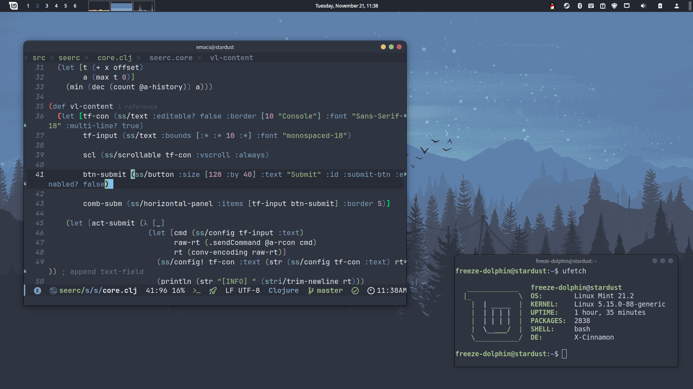
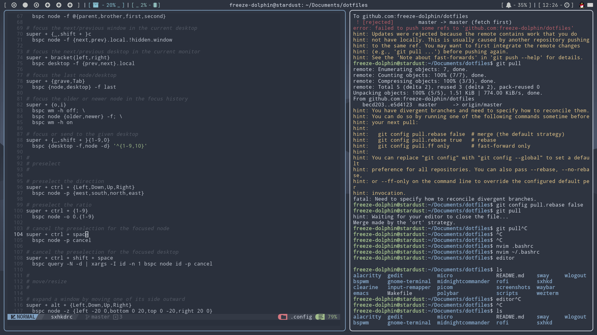

# dotfiles

:wrench: [.files] some scripts and configurations of mine.

## screenshots

这个环境本底采用了 [Cinnamon Desktop Customization | Nord Color Theme _ by LinuxScoop](https://www.youtube.com/watch?v=h1yIY1BwetQ)

---

---

